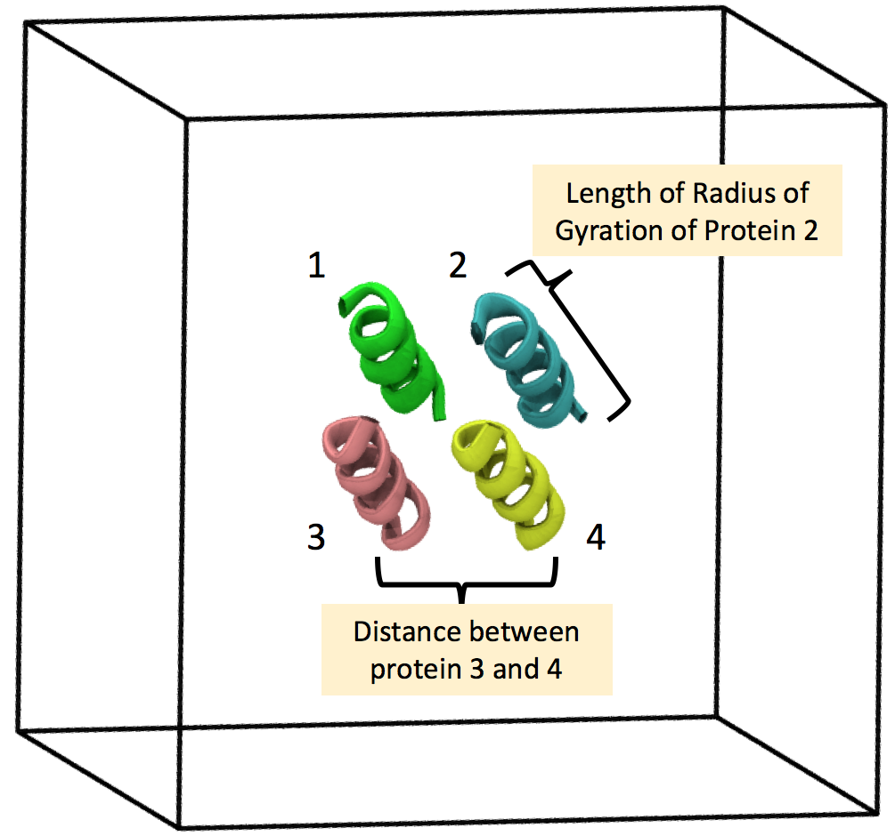

# A tool for exploratory data analysis of time series data from molecular dynamics simulations 

## Abstract
In this paper, I present a visualization tool for exploring molecular simulation data. This tool addresses the design concern that quantitative data - like energy, distance, and pressure - and structural data are visualized separately and thereby lose context. This tool contains a 3D rendering of the structure at each time step and 2D scatter plot distribution of points denoting relationships between physical data at each time step. This web-based GUI platform for visualizing both types of data will decrease user interface with too many software, decrease scripting time, promote collaboration and increase exposure of data for exploratory analysis. I also tested this tool with domain researchers to understand how they used it and the extensions that they would prefer.

Find the related poster [here] (final/poster-arushi3.pdf)  
Find the writeup for the project [here] (final/paper-arushi3.pdf)  
Find a summary image of the tool [here] (final/summary.png)  

## Running the web-based tool
[Link] (http://cse512-16s.github.io/fp-arushiprakash/) to the site  

## Research/Development of Project  
The project developed on 3 fronts - improving the scatter plot, improving the 3D rendering and improving UI. Here were the main concerns for all of them:  
* Improving the scatter plot - The algorithm for multi-dimensional scaling, making scatter plots, adding tooltip information and so on were pretty standard. Adding features like filters, connecting data points to structure so that they render the correct image on clicking, point selectio and writing to file, dynamically updating all selections, filters and dropdown boxes according to user's data were the most time-consuming aspects. I also obtained a lot of feedback from domain users who were skeptical of features like fisheye zoom, the validity of the scatter plot, and general usability of the tool. It was essential at all times for the user to have the option to access real data bound to these points at all times. All these features were coded using javascript and d3.    
* Improving the 3D rendering - The Threejs package was used to make the molecules which works on webGL. The greatest challenge was speeding up the rendering process - also the users' greatest complaints- since it is not as optimized as openGL. To speed up the system, only atoms are repesented and not bonds. Te challenging part was creating a parser that would crunch user data in its original form and make it amenable to making a 3D model quickly and also be able to access different structures at different times. The colors of atoms and size of atoms are standards used in the world of molecular modelling.  
* Improving the UI - The UI needed to be simple and distraction free. Getting options dynamically and giving users options to hide various options when they want to concentrate on other activites was the main concern here.  
The most important way to improve my tool was getting user feedback!

## Sample data (used for demo) 
  This data come from a protein simulation - 4 LK-alpha 14 proteins (shown below) in water (not shown). The size of the proteins (radius of gyration), inter-protein distances, energy and other association parameters have been tracked during the simulation. This data usually fluctuates (a lot) within a range and occasionally jumps to a new state or value. Fluctuations capture the stability of the system and jumps are important to track rare-events in the simulations.  
    
  
  The time series data - usually energy, length of protein, distance from reference particle - is uploaded to the plotting engine. Each data point is placed on the plot at some relative distance to other points depending on their closeness with respect to a set of variables. For example, when we plot energy, two points with similar energy are plotted close together. When we plot Energy & Distance, two points with a similar combination of both variables are near each other. The dot color tells the reader if the event occurs earlier or later in time - light blue colors for earlier time. 
